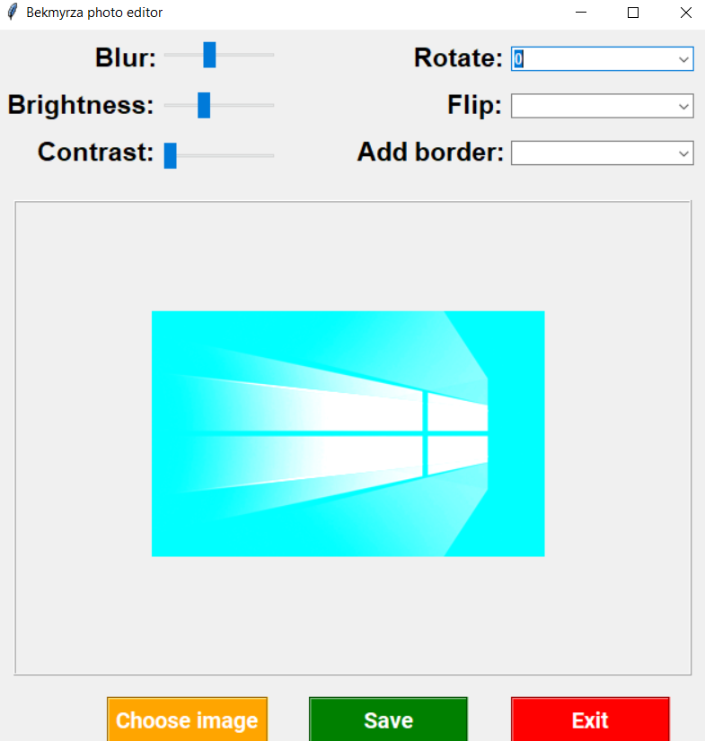
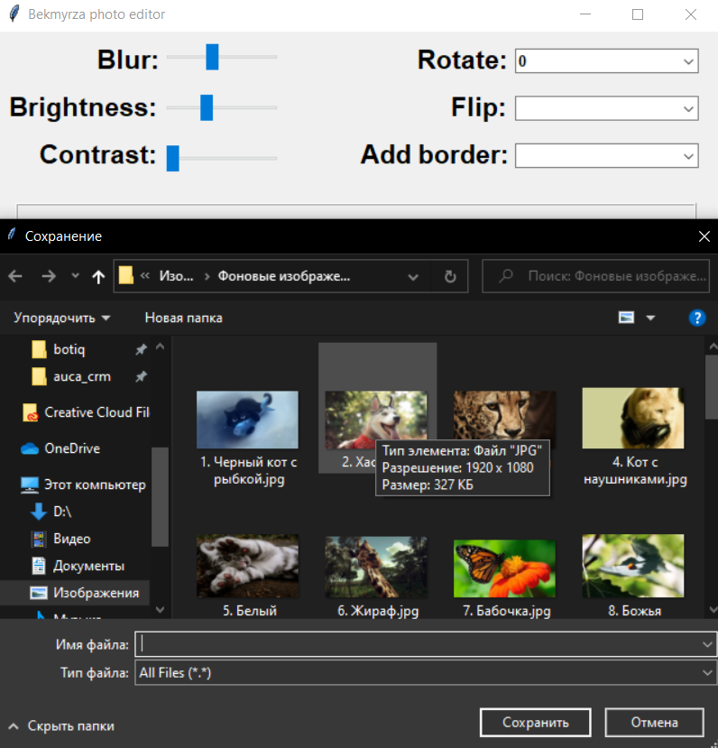

#  Photo brightness, blur, contrast editing app

#### Simple in use app for editing your photos. In this project Tkinter and Pillow libraries were used.

### Main interface

### Choosing directory to save

#### To launch you have to
1. Create virtual environment
2. install packages from req.txt
3. launch main.py file